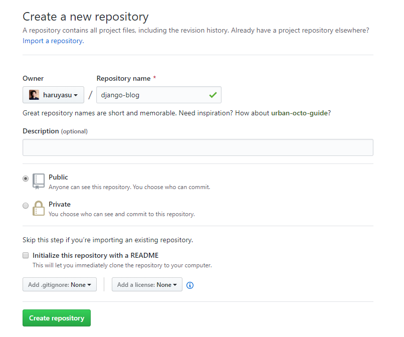

# 準備

## GitHub

好きな名前でGitHubのリポジトリを作成します。



ローカルにリポジトリ名と同じフォルダを作成します。

ローカルフォルダとGitHubのリポジトリを連携します。
```
echo "# django-blog" >> README.md
git init
git add README.md
git commit -m "first commit"
git remote add origin https://github.com/haruyasu/django-blog.git
git push -u origin master
```
※作成したリポジトリ名に変更します。

この時点でREADME.mdだけコミットされていると思います。

### ignoreファイルを追加

ルートディレクトリに.gitignoreファイルを作成します。

記述されたファイルは、git管理下から除外されてコミットされなくなります。

.gitignore
```
myvenv
db.sqlite3
.vscode
__pycache__
*.pyc
```

## 仮想環境

仮想環境を作成します。

```
$ python3 -m venv myvenv
```
### 仮想環境実行

sourceコマンドで仮想環境が実行できます。

```
$ source myvenv/bin/activate
```

## パッケージをインストール

requirements.txtを作成し、開発に必要なパッケージをインストールします。

```
django-template
├── myvenv
│   └── ...
└───requirements.txt
```

requirements.txt
```
Django~=2.2
django-heroku==0.3.1
gunicorn==19.9.0
```
※ django-herokuはHerokuにデプロイする時に必要なパッケージです。

```
(myvenv) ~$ pip3 install -r requirements.txt
```

django-herokuをインストールすると、他のパッケージも複数同時にインストールされます。

psycopg2が自動的にインストールされますが、もしエラーが発生した場合は、python3-devをインストールします。

psycopg2以外のエラーが発生した場合は、エラー内容を検索すると解決方法が見つかると思います。

Linux(Ubuntu)の場合
```
sudo apt-get install python3-dev
```
※ コマンドはOSによって変更して下さい。
