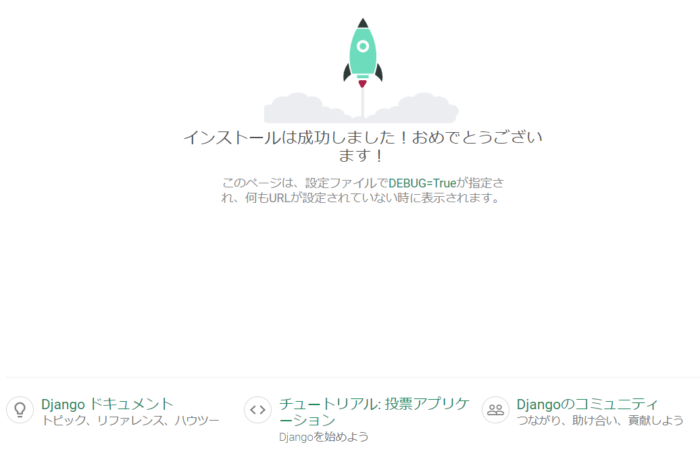

# プロジェクトの作成

django-adminコマンドでプロジェクトを作成します。

```
(myvenv) ~$ django-admin startproject mysite .
```

## 環境設定変更

settings.pyを変更します。

mysite/settings.py
```python
ALLOWED_HOSTS = ['*']

LANGUAGE_CODE = 'ja'
TIME_ZONE = 'Asia/Tokyo'

STATIC_URL = '/static/'
STATIC_ROOT = os.path.join(BASE_DIR, 'static')
```

## データベースのセットアップ

migrateコマンドをすることでデータベースがセットアップされます。

```
(myvenv) ~$ python3 manage.py migrate
```

## Webサーバーを起動する

```
(myvenv) ~$ python3 manage.py runserver
```
URLにアクセスすると、Webページが表示されます。  
http://127.0.0.1:8000/

Webサーバーを停止するには、Ctrl + Cを同時に押すと停止します。


