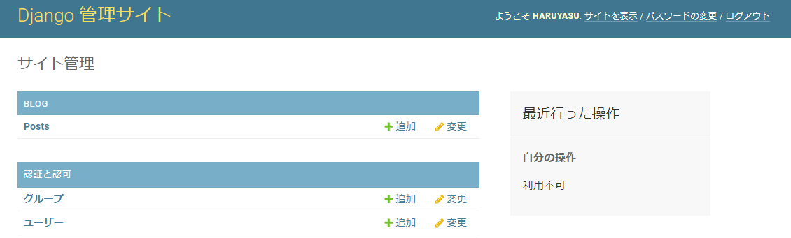
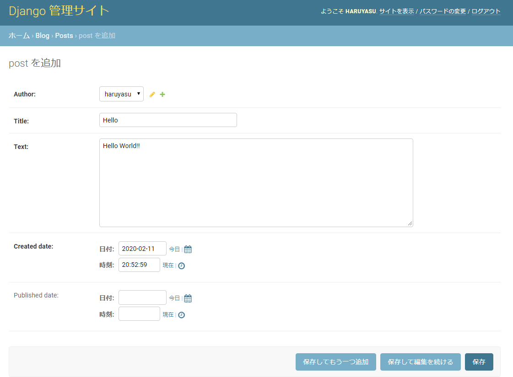

# 管理画面の作成

Djangoには管理画面が存在します。

管理画面では投稿や編集、削除などweb上でデータベースを操作することができる便利画面です。

作成したモデルを管理画面で見えるようにします。

blog/admin.py
```python
from django.contrib import admin
from .models import Post

admin.site.register(Post)
```

## 管理ユーザー作成

createsuperuserコマンドで管理ユーザーを作成することができます。

```
(myvenv) ~$ python3 manage.py createsuperuser
```
ユーザー名、メールアドレス、パスワードを入力します。  
パスワードは見えないので、間違えずに入力して下さい。

## Webサーバー開始

```
(myvenv) ~$ python3 manage.py runserver
```

http://127.0.0.1:8000/admin/

ユーザー名とパスワードを入力すると、管理画面が表示されます。



「Posts」をクリックして「POSTを追加」ボタンで、記事を追加してみて下さい。


