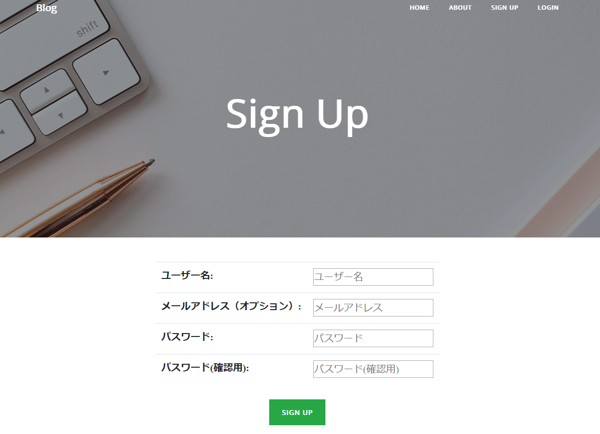

# 認証機能を追加

会員制のWebアプリケーションを構築するには、認証機能が必須となります。

今回は、ログイン、ログアウト、サインイン機能を実装します。




別のWebアプリケーションでも再利用ができるように、認証機能は新しいアプリケーションを作成します。

## 認証用のアプリケーションを追加

別のアプリケーションとして作成すると、後から変更がしやすくなります。

blogと同じ要領でaccountsアプリケーションを作成します。

```
(myvenv) ~$ python3 manage.py startapp accounts
```

作成したaccountsアプリケーションをmysiteプロジェクトに登録します。

settings.pyに'accounts.apps.AccountsConfig'を追加します。

settings.py
```
INSTALLED_APPS = [

    'blog.apps.BlogConfig',
    'accounts.apps.AccountsConfig',
]
```

## django-allauthをインストール

認証機能を提供するパッケージがdjango-allauthです。

Djangoのローカル認証だけではなく、ソーシャル認証も可能になります。

GoogleアカウントやFacebookアカウントなどを使用してログインできます。

* サインアップ
* ログイン
* ログアウト
* パスワードリセット
* メールアドレス認証

など、色々なことができます。

https://www.intenct.nl/projects/django-allauth/

django-allauthをインストールします。

```
(myvenv) ~$ pip3 install django-allauth
```

django-allauthをアプリケーションで使用するため、プロジェクト設定を編集します。

settings.py
```python
INSTALLED_APPS = [

    'accounts.apps.AccountsConfig',
    'django.contrib.sites',
    'allauth', 
    'allauth.account',
    'allauth.socialaccount',
]

# 一番下に追加
SITE_ID = 1
LOGIN_REDIRECT_URL = '/'
ACCOUNT_LOGOUT_REDIRECT_URL = '/'
# SignUpした時に確認Emailアドレスを送信しない場合
ACCOUNT_EMAIL_VERIFICATION = 'none'
# SignUpした時に確認Emailアドレスを送信する場合
# EMAIL_HOST = 'smtp.gmail.com'
# EMAIL_PORT = 587
# EMAIL_HOST_USER = 'gmail adress'
# EMAIL_HOST_PASSWORD = 'gmail password'
# EMAIL_USE_TLS = True
```

今回は、メールアドレスの認証をしていませんが、もしメールアドレス認証機能を追加する場合は、設定を変更して下さい。

## ルーティングを追加

認証用のルーティングは、mysiteのurls.pyのみ修正します。

mysite/urls.py
```python
urlpatterns = [
    path('admin/', admin.site.urls),
    path('', include('blog.urls')),
    path('accounts/', include('allauth.urls')), # 追加
]
```

この1行を追加するだけで、多くの認証機能を使用することができます。

今回は、下記3つのテンプレートを作成します。
* サインアップ  
http://127.0.0.1:8000/accounts/signup/
* ログイン  
http://127.0.0.1:8000/accounts/login/
* ログアウト  
http://127.0.0.1:8000/accounts/logout/

もし下記機能を使用したい場合は、テンプレートを追加して確認してみて下さい。
* サインアップ(メール送信)  
http://127.0.0.1:8000/accounts/confirm-email/
* サインアップ(確定)  
http://127.0.0.1:8000/accounts/confirm-email/<キー>/
* パスワードリセット  
http://127.0.0.1:8000/accounts/password/reset/
* パスワードリセット(メール送信)  
http://127.0.0.1:8000/accounts/password/reset/done/
* パスワードリセット(パスワード設定)  
http://127.0.0.1:8000/accounts/password/reset/key/<キー>-set-password/
* パスワードリセット(確定)  
http://127.0.0.1:8000/accounts/password/reset/key/done/

## django-allauthのテンプレートを追加

django-allauthにはデフォルトのテンプレートがありますが、独自のテンプレートを追加していきます。

accountsフォルダの中にtemplatesフォルダ作成し、accountフォルダを作成して下さい。

その中にlogin.html、logout.html、signup.htmlを作成します。

accounts/templates/account/login.html
```html



<div class="site-heading">
  <h1>Login</h1>
</div>



  <div class="row justify-content-center">
    <p>アカウントをまだお持ちでなければ、こちらから<a href="">ユーザー登録</a>して下さい。</p>
    <form method="post" action="">
      
      <table class="table">{{ form.as_table }}</table>
      
      <input type="hidden" name="{{ redirect_field_name }}" value="{{ redirect_field_value }}" />
      
      <div class="text-center">
        <a class="button secondaryAction" href="">パスワードをお忘れですか？</a>
        <p>
          <button type="submit" class="save btn btn-success" role="button">Login</button>
        </p>
        </div>
    </form>
  </div>

```

accounts/templates/account/logout.html
```html



<div class="site-heading">
  <h1>Log Out</h1>
</div>



  <div class="row justify-content-center">
    <form method="post" action="">
      
      
      <input type="hidden" name="{{ redirect_field_name }}" value="{{ redirect_field_value }}"/>
      
      <div class="text-center">
        <p>ログアウトしますか？</p>
        <p>
          <button type="submit" class="save btn btn-success" role="button">Log Out</button>
        </p>
      </div>
    </form>
  </div>

```

accounts/templates/account/signup.html
```html



<div class="site-heading">
  <h1>Sign Up</h1>
</div>



  <div class="row justify-content-center">
    <form method="post" action="">
      
      <table class="table">{{ form.as_table }}</table>

      
      <input type="hidden" name="{{ redirect_field_name }}" value="{{ redirect_field_value }}" />
      

      <div class="text-center">
        <p>
          <button type="submit" class="save btn btn-success" role="button">Sign Up</button>
        </p>
      </div>
    </form>
  </div>

```

### ナビゲーションを変更

baseを修正して、ナビゲーションにLog out、Sign up、Loginボタンを追加します。

blog/templates/blog/base.html
```html

<li class="nav-item">
  <a class="nav-link" href="">Post</a>
</li>
<li class="nav-item">
  <a class="nav-link" href="">Draft</a>
</li>
<li class="nav-item">
  <a class="nav-link" href="">Log out</a>
</li>

<li class="nav-item">
  <a class="nav-link" href="">Sign up</a>
</li>
<li class="nav-item">
  <a class="nav-link" href="">Login</a>
</li>

```

## マイグレーション実行

新しくaccountsアプリケーションを追加したので、マイグレーションをする必要があります。

```
(myvenv) ~$ python3 manage.py migrate
```

## サーバー実行

```
(myvenv) ~$ python3 manage.py runserver
```

これでユーザー認証機能が実装されました。

django-allauthを使用すると簡単に実装できます。

デザインなどは自由に変更してみて下さい。

実際にサインアップしてユーザー登録してみましょう。

ログインしたら、投稿、編集、削除ボタンが表示されていることを確認してみて下さい。

そして、ログアウトすると、投稿、編集、削除ボタンが表示されません。
