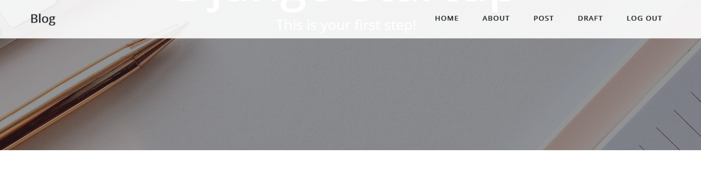

# JavaScriptで動きをつける

スクロールした時にナビゲーションが表示される動きを付けます。



base.htmlにJavaScriptを追記します。

blog/templates/blog/base.html
```html
  <script src="https://code.jquery.com/jquery-3.4.1.slim.min.js"></script>
  <script src="https://stackpath.bootstrapcdn.com/bootstrap/4.4.1/js/bootstrap.min.js"></script>
  <script src=""></script>

</body>

</html>
```

blog/static/jsフォルダを作成します。

```
└── blog
    └── static
        └── js
            └── blog.js
```

blog.jsファイルを作成します。

JavaScript:blog/static/js/blog.js
```JavaScript
"use strict";

const mainNav = document.querySelector("#mainNav")

// windowの幅が992px以上の場合
if (window.innerWidth > 992) {
  let previousTop = 0;

  // スクロールイベント
  window.addEventListener('scroll', (e) => {
    // トップを取得
    let currentTop = document.documentElement.scrollTop || document.body.scrollTop;

    if (currentTop < previousTop) {
      // スクロールUP
      if (currentTop > 0 && mainNav.classList.contains('is-fixed')) {
        mainNav.classList.add("is-visible");
      } else {
        // スクロールTOP
        mainNav.classList.remove("is-visible", "is-fixed");
      }
    } else if (currentTop > previousTop) {
      // スクロールDOWN
      mainNav.classList.remove("is-visible");

      if (currentTop > mainNav.clientHeight && !mainNav.classList.contains('is-fixed')) {
        mainNav.classList.add("is-fixed");
      }
    }
    previousTop = currentTop;
  });
}
```

下にスクロールして、上にスクロールするとナビゲーションが表示するようになりました。
