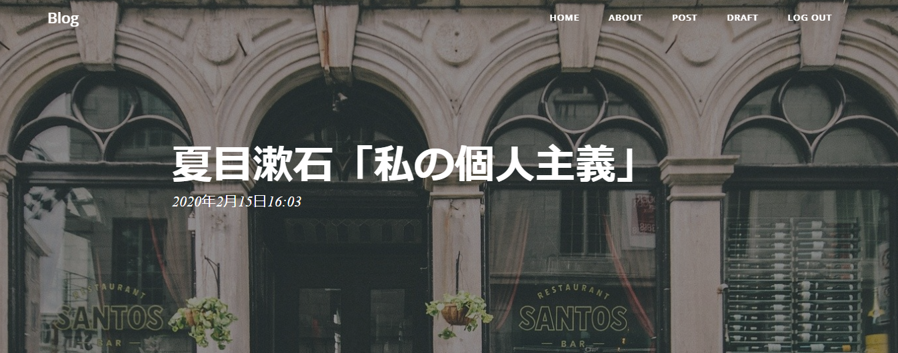

# ヘッダー画像の追加

各投稿ページのヘッダー画像を変更する機能を追加します。



## デフォルト画像の追加

デフォルトで表示する画像を追加します。

blog/static/imgフォルダを作成して、その中にtitle.pngを追加します。

```text
└── blog
    └── static
        └── img
            └── title.png
```

フリー素材を使用して、好きな画像をタイトルに追加しましょう。

https://pixabay.com/

ブログで使用する画像は、著作権に気を付けて下さい。

自分で撮影した画像は問題ありません。

## 画像圧縮

画像のサイズが重いと表示速度に影響が出ますので、下記のサイトを使用して、画像を圧縮してから保存します。

幅：1920px 縦：500px

あまりに大きいサイズの画像は必要ありませんので、画像編集ソフトでトリミングしておきます。

https://imagecompressor.com/ja/

## 画像変更機能追加

投稿画面で画像ファイルを指定して、ヘッダー画像として表示します。

### 画像格納フォルダを作成

ルートディレクトリにimagesフォルダを作成します。

```
/images/
```

### 画像ライブラリをインストール

Pythonの画像処理ライブラリPillowをインストールします。

```
(myvenv) ~$ pip3 install pillow
```

### 設定ファイルを変更

settings.pyを変更して、追加したimagesフォルダを認識するようにします。

settings.py
```python
IMAGE_ROOT = os.path.join(BASE_DIR, 'images')
IMAGE_URL = '/images/'
```

### 画像フォルダをurlsに追加

画像フォルダの場所をurlsに追加して、画像を使用できるようにします。

mysite/urls.py
```python
from django.conf.urls.static import static
from django.conf import settings

urlpatterns += static(settings.IMAGE_URL, document_root=settings.IMAGE_ROOT)
```

### 画像のモデルを追加

画像をアップロードしたいので、モデルに追加します。

ImageFieldを使用します。

upload_toでアップロードする画像の場所を指定します。

blog/models.py
```python
class Post(models.Model):
  	author = models.ForeignKey(settings.AUTH_USER_MODEL, on_delete=models.CASCADE)
  	image = models.ImageField(upload_to='images',blank=True, null=True)　# 追加
```

### フィールドを追加

forms.pyにimageフィールドを追加します。

blog/forms.py
```python
class PostForm(forms.ModelForm):
	class Meta:
		model = Post
		fields = ('author', 'title', 'text', 'image')　# 追加
```

### テンプレートを変更

投稿画面で画像を投稿できるようにします。

formにenctype="multipart/form-data"を追加します。

画像をアップロードするにはこの指定が必要になります。

blog/templates/blog/post_form.html
```html

	<form method="POST" class="post-form" enctype="multipart/form-data">
		
		{{ form.as_p }}
		<div class="text-right">
			<button type="submit" class="save btn btn-success" role="button">Save</button>
		</div>
	</form>

```

詳細画面のヘッダーで画像が表示されるようにします。

CSSでbackground-imageを上書きしています。

blog/templates/blog/post_detail.html
```html

<style>
	header.masthead {
		background-image: url('/{{ post.image.url }}') !important;
	}
</style>


<p>
  {{ post.text|linebreaksbr }}
</p>
```

## マイグレーション実行

モデルを変更したので、マイグレーションをする必要があります。

```
(myvenv) ~$ python3 manage.py makemigrations
(myvenv) ~$ python3 manage.py migrate
```

## サーバー実行

```
(myvenv) ~$ python3 manage.py runserver
```

投稿画面で画像をアップロードできるようになりました。

画像をアップロードして、ヘッダーの画像が変更されるか確認してみましょう。

## Herokuを使う場合

※Heroku以外を使用する方は飛ばして下さい。

今回、WebサーバーはHerokuを使用します。

しかし、Herokuは画像、動画のアップロードに対応していません。

そこで、cloudinaryを使用します。

### Cloudinaryとは

Cloudinaryは、メディアファイルのアップロードやクラウド上のストレージへの保管ができるサービスです。

https://cloudinary.com/

### アカウントの作成

右上ボタンの「SING UP FOR FREE」ボタンを押して、アカウントを作成して下さい。

Account Detailにユーザー情報が表示されます。
```
Cloud name:	xxx
API Key: xxx
API Secret:	xxx
```

### cloudinaryをインストール

cloudinaryをインストールします。

```
pip3 install install django-cloudinary-storage
```

### Herokuにcloudinaryをインストール

Herokuにcloudinaryのaddonをインストールします。

```
heroku addons:add cloudinary:starter
```

### 設定変更

Account Detailに表示された情報をCLOUDINARY_STORAGEに追加します。

```python
INSTALLED_APPS = [
    ...
    'cloudinary', # 追加
    'cloudinary_storage',# 追加
]

# 追加
DEFAULT_FILE_STORAGE = 'cloudinary_storage.storage.MediaCloudinaryStorage'
# 追加
CLOUDINARY_STORAGE = {
    'CLOUD_NAME': 'xxx',
    'API_KEY': 'xxx',
    'API_SECRET': 'xxx'
}
```

### テンプレート変更

urlのスラッシュを削除します。

ローカルに保存する場合は必要でしたが、今はクラウドに保存するので、必要がなくなりました。

blog/templates/blog/post_detail.html
```html

<style>
	header.masthead {
		background-image: url('{{ post.image.url }}') !important;
	}
</style>

```

### 画像フォルダ削除

先ほど追加したimagesフォルダは必要ないので削除します。

```
/images/
```

### サーバー実行

```
(myvenv) ~$ python3 manage.py runserver
```

これで画像の保存先がcloudinaryとなり、Herokuでも画像が投稿できるようになりました。

投稿画面で試してみましょう。
