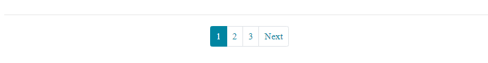

# ページネーション機能の追加

ページネーション機能を追加します。

## ページネーションとは

ページネーションとは、内容の多いページを複数のページに分割し、各ページへのリンクを並べてアクセスしやすくする機能です。



Djangoでは簡単にページネーション機能が実装できます。

## ページネーションをViewに追加

paginate_by変数をオーバーライドするだけで、ページネーションが実装できます。

好きな数字を代入して下さい。

今回は、3投稿ずつ表示するようにします。

blog/views.py
```python
class PostListView(ListView):
	model = Post
	template_name = "blog/post_list.html"
	paginate_by = 3 # 追加
```

## ページネーションをテンプレートに追加

一番下のendblockの上に追加します。

blog/templates/blog/post_list.html
```html
	<ul class="pagination pagination-sm justify-content-center">
		
			<li class="page-item">
				<a class="page-link" href="?page={{ page_obj.previous_page_number }}">
					<span aria-hidden="true">Prev</span>
				</a>
			</li>
		

		
			
				<li class="page-item active"><a class="page-link" href="#!">{{ num }}</a></li>
			
				<li class="page-item"><a class="page-link" href="?page={{ num }}">{{ num }}</a></li>
			
		

		
			<li class="page-item">
				<a class="page-link" href="?page={{ page_obj.next_page_number }}">
					<span aria-hidden="true">Next</span>
				</a>
			</li>
		
	</ul>

```

これだけで、ページネーションが実装できました。

ページネーションをクリックして、ページが分割されているか確認してみて下さい。
