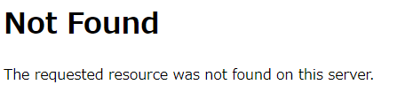
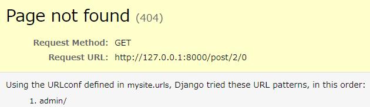

# Herokuデプロイ

デプロイとは、特定の環境下でアプリケーションやシステムを使えるようにすることです。

Herokuにデプロイして、Webアプリケーションを世界中に公開しましょう。

デプロイすることによって、多くの人にあなたのWebアプリケーションを使ってもらえるようになります。

## デプロイ準備

### パッケージ定義

freezeコマンドをすることによって、アプリを動かすためのパッケージを一覧にまとめることができます。

```
(myvenv) ~$ pip3 freeze > requirements.txt
```

このような内容になります。バージョンは実行時期によって異なります。

requirements.txt
```
asgiref==3.2.3
dj-database-url==0.5.0
Django==2.2.10
django-heroku==0.3.1
gunicorn==19.9.0
psycopg2==2.8.4
pytz==2019.3
sqlparse==0.3.0
whitenoise==5.0.1
```

### Procfile作成

Procfileは、アプリのプロセスタイプやエントリーポイントを宣言するファイルです。

Procfileを作成します。

```
django-blog
└── Procfile
```

Procfile
```
web: gunicorn mysite.wsgi
```

mysiteの部分はあなたが作成したアプリのディレクトリ名を指定します。

gunicornと、HerokuでDjangoをデプロイするときに必要なWebサーバーです。

### runtime.txt作成

runtime.txtにはプログラム実行時に必要なものを定義します。

ここではPythonが必要なのでPythonのバージョンを指定します。

runtime.txtを作成します。

```
django-blog
└── runtime.txt
```

runtime.txt
```
python-3.6.9
```

## Herokuを操作

Herokuにデプロイする準備ができましたので、Herokuを操作していきます。

### Herokuアカウント作成

まずはHerokuのアカウントを作成します。

https://signup.heroku.com/

### Heroku CLIインストール

OSに合わせてHeroku CLIをインストールします。

インストールすることによって、コマンドラインからHerokuの操作が出来るようになります。

https://devcenter.heroku.com/articles/getting-started-with-python

### Herokuにログイン

ターミナルからHerokuにログインします。

```
$ heroku login
```

コマンドを実行すると、ログイン用のWebページが表示されますので、ログインボタンを押して下さい。


### Herokuプロジェクト作成

Herokuにプロジェクトを作成します。

好きなプロジェクト名を指定して下さい。

このプロジェクト名がURLになりますので、既に他の人に使われているプロジェクト名は指定できません。

```
$ heroku create django-blog
```

このように表示されたら成功です。
```
Creating ⬢ django-blog... done
https://django-blog.herokuapp.com/ | https://git.heroku.com/django-blog.git
```

### Herokuにpush

Herokuにpushする前に、GitHubにすべてコミットしておいて下さい。

```
$ git push heroku master
```

デプロイ完了とメッセージが表示されます。
```
remote:        https://django-blog.herokuapp.com/ deployed to Heroku
remote: 
remote: Verifying deploy... done.
To https://git.heroku.com/django-blog.git
 * [new branch]      master -> master
```

### プロセスを起動

このままだとgunicornのサーバーが起動していないため、アプリケーションが起動しません。

以下のコマンドで起動します。

```
$ heroku ps:scale web=1
```

このように表示されたら成功です。
```
Scaling dynos... done, now running web at 1:Free
```

### Herokuのデータベースを構築

migrateコマンドをしてデータベースを構築します。

```
$ heroku run python manage.py migrate
```

このように表示されたら成功です。
```
Running python manage.py migrate on ⬢ django-blog... up, run.5146 (Free)
Operations to perform:
  Apply all migrations: admin, auth, blog, contenttypes, sessions
Running migrations:
  Applying contenttypes.0001_initial... OK
  Applying auth.0001_initial... OK
  Applying admin.0001_initial... OK
  Applying admin.0002_logentry_remove_auto_add... OK
  Applying admin.0003_logentry_add_action_flag_choices... OK
  Applying contenttypes.0002_remove_content_type_name... OK
  Applying auth.0002_alter_permission_name_max_length... OK
  Applying auth.0003_alter_user_email_max_length... OK
  Applying auth.0004_alter_user_username_opts... OK
  Applying auth.0005_alter_user_last_login_null... OK
  Applying auth.0006_require_contenttypes_0002... OK
  Applying auth.0007_alter_validators_add_error_messages... OK
  Applying auth.0008_alter_user_username_max_length... OK
  Applying auth.0009_alter_user_last_name_max_length... OK
  Applying auth.0010_alter_group_name_max_length... OK
  Applying auth.0011_update_proxy_permissions... OK
  Applying blog.0001_initial... OK
  Applying blog.0002_comment... OK
  Applying sessions.0001_initial... OK
```

### 管理ユーザーを作成

ローカルと同じようにHerokuでも管理ユーザーを作成することができます。

```
$ heroku run python manage.py createsuperuser
```

ユーザー名、メールアドレス、パスワードを入力します。
パスワードの入力は表示されませんので、間違えずに入力して下さい。
```
Running python manage.py createsuperuser on ⬢ django-blog... up, run.6023 (Free)
ユーザー名:
メールアドレス:
Password: 
Password (again): 
Superuser created successfully.
```

これで無事デプロイ完了です。

デプロイしたURLにアクセスしてみましょう。

ローカルと同じ画面が表示されているはずです。

最初はデータがない初期状態なので、ブログを投稿してみましょう。

## セキュリティを高める

デプロイは成功しましたが、セキュリティ上の問題があります。

### DebugをFalse

現在、Debug機能が有効になっているため、もしエラーが発生した場合、詳細な情報が表示されてしまいます。

ローカルではいいのですが、本番環境で詳細な情報は表示されたくありません。

.gitignoreファイルに、local_settings.pyを追記します。

.gitignore
```
...
local_settings.py
```

local_settings.pyファイルを作成します。

ローカルのみDEBUG機能を有効にします。

mysite/local_settings.py
```python
import os

BASE_DIR = os.path.dirname(os.path.dirname(os.path.abspath(__file__)))
DATABASES = {
    'default': {
        'ENGINE': 'django.db.backends.sqlite3',
        'NAME': os.path.join(BASE_DIR, 'db.sqlite3'),
    }
}
DEBUG = True
```

setting.pyを変更します。

mysite/settings.py
```python
# Falseに変更
DEBUG = False

# 追加
try:
    from .local_settings import *
except ImportError:
    pass

# Debug=Falseの時だけ実行する設定
if not DEBUG:
    import django_heroku
    django_heroku.settings(locals())
```

GitHubにコミットしておきます。

Herokuにもpushします。

```
$ git push heroku master
```

これで本番環境でデバッグ機能が無効になり、詳細な情報が表示されなくなりました。

存在しないURLを打ってみましょう。

Not Foundと表示されるはずです。



ローカルで存在しないURLを打ってみると、詳細な情報が表示されます。



### SECRET KEYがハードコーディングされている

セキュリティ上、SECRET KEYを直接書くのは良くありません。

先ほど作成した、local_settings.pyにSECRET_KEYを移動させましょう。

mysite/local_settings.py
```python
# SECURITY WARNING: keep the secret key used in production secret!
SECRET_KEY = 'xxxxxxxxxxxxxxxxxxxx'
```

settings.pyのSECRET_KEYは削除します。

mysite/settings.py
```python
# 削除
SECRET_KEY = 'xxxxxxxxxxxxxxxxxxxx'

if not DEBUG:
    import django_heroku
    django_heroku.settings(locals())
    SECRET_KEY = os.environ['SECRET_KEY']
```

本番環境でSECRET_KEYを設定するには、heroku config:setコマンドを使います。

実際のSECRET_KEYに置き換えて実行します。

```
$ heroku config:set SECRET_KEY="xxxx"
```

heroku configコマンドでHerokuの環境変数を見ることができます。

```
$ heroku config
```
SECRET_KEYが表示されていれば成功です。

本番環境が動作するか確認しておきましょう。

DjangoでWebアプリケーションの作成方法が分かったのではないでしょうか。

ぜひ色々試して機能を追加して、さらに理解を深めていきましょう。

以上
